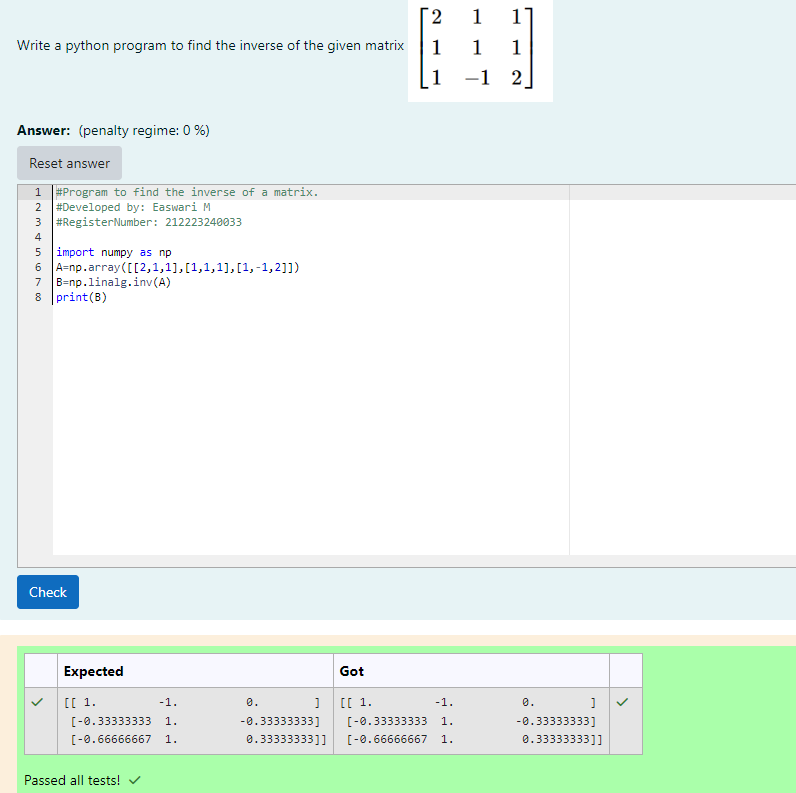

# INVERSE-OF-A-MATRIX
## Aim:
To write a python program to find the inverse of a matrix
## Equipment’s required:
1. 	Hardware – PCs
2. 	Anaconda – Python 3.7 Installation / Moodle-Code Runner
## Algorithm:
### Step1 : Import numpy as np.
### Step 2: Define the matrix A as a NumPy array with given values.
### Step 3: Using the np.linalg.inv() we can find the inverse of a matrix.
### Step 4: End the program

## Program:
```
#Program to find the inverse of a matrix.
#Developed by: Easwari M
#RegisterNumber: 212223240033

import numpy as np
A=np.array([[2,1,1],[1,1,1],[1,-1,2]])
B=np.linalg.inv(A)
print(B)
```
## Output:



## Result:
Thus the inverse of given matrix is successfully solved using python program

